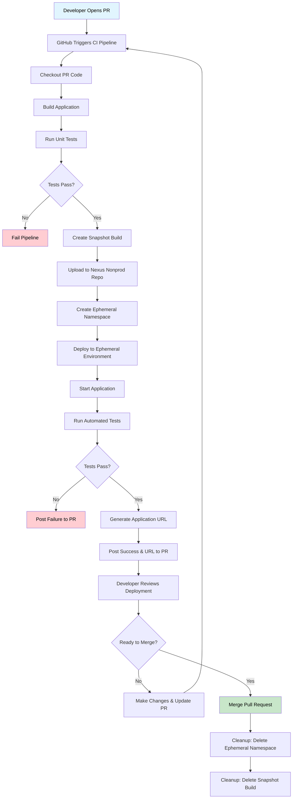
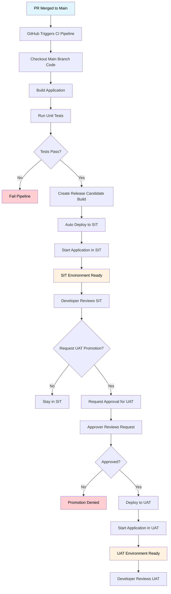
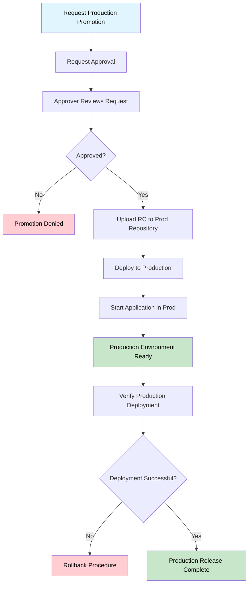
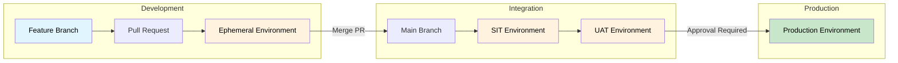
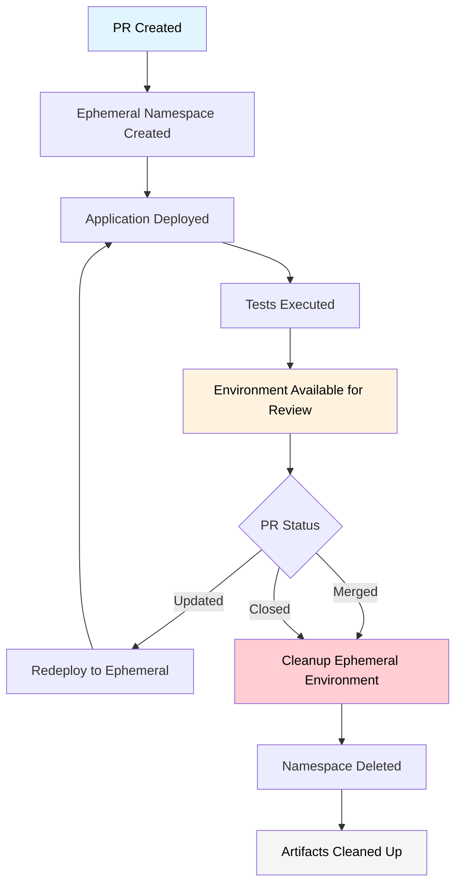

# Deployment Flow

## PR and Ephemeral Build Flow

```mermaid
flowchart TD

    A[Developer Opens PR] --> B[GitHub Triggers CI Pipeline]
    B --> C[Checkout PR Code]
    C --> D[Build Application]
    D --> E[Run Unit Tests]
    E --> F{Tests Pass?}
    F -->|No| G[Fail Pipeline]
    F -->|Yes| H[Create Snapshot Build]
    H --> I[Upload to Nexus Nonprod Repo]
    I --> J[Create Ephemeral Namespace]
    J --> K[Deploy to Ephemeral Environment]
    K --> L[Start Application]
    L --> M[Run Automated Tests]
    M --> N{Tests Pass?}
    N -->|No| O[Post Failure to PR]
    N -->|Yes| P[Generate Application URL]
    P --> Q[Post Success & URL to PR]
    Q --> R[Developer Reviews Deployment]
    R --> S{Ready to Merge?}
    S -->|No| T[Make Changes & Update PR]
    T --> B
    S -->|Yes| U[Merge Pull Request]
    U --> V[Cleanup: Delete Ephemeral Namespace]
    V --> W[Cleanup: Delete Snapshot Build]
    
    style A fill:#e1f5fe,color:#000000
    style U fill:#c8e6c9,color:#000000
    style G fill:#ffcdd2,color:#000000
    style O fill:#ffcdd2,color:#000000
```

## Nonprod Promotion Flow

```mermaid
flowchart TD
    A[PR Merged to Main] --> B[GitHub Triggers CI Pipeline]
    B --> C[Checkout Main Branch Code]
    C --> D[Build Application]
    D --> E[Run Unit Tests]
    E --> F{Tests Pass?}
    F -->|No| G[Fail Pipeline]
    F -->|Yes| H[Create Release Candidate Build]
    H --> I[Auto Deploy to SIT]
    I --> J[Start Application in SIT]
    J --> K[SIT Environment Ready]
    K --> L[Developer Reviews SIT]
    L --> M{Request UAT Promotion?}
    M -->|No| N[Stay in SIT]
    M -->|Yes| O[Request Approval for UAT]
    O --> P[Approver Reviews Request]
    P --> Q{Approved?}
    Q -->|No| R[Promotion Denied]
    Q -->|Yes| S[Deploy to UAT]
    S --> T[Start Application in UAT]
    T --> U[UAT Environment Ready]
    U --> V[Developer Reviews UAT]
    
    style A fill:#e1f5fe,color:#000000
    style K fill:#fff3e0,color:#000000
    style U fill:#fff3e0,color:#000000
    style G fill:#ffcdd2,color:#000000
    style R fill:#ffcdd2,color:#000000
```

## Production Promotion Flow

```mermaid
flowchart TD
    A[Request Production Promotion] --> B[Request Approval]
    B --> C[Approver Reviews Request]
    C --> D{Approved?}
    D -->|No| E[Promotion Denied]
    D -->|Yes| F[Upload RC to Prod Repository]
    F --> G[Deploy to Production]
    G --> H[Start Application in Prod]
    H --> I[Production Environment Ready]
    I --> J[Verify Production Deployment]
    J --> K{Deployment Successful?}
    K -->|No| L[Rollback Procedure]
    K -->|Yes| M[Production Release Complete]
    
    style A fill:#e1f5fe,color:#000000
    style I fill:#c8e6c9,color:#000000
    style M fill:#c8e6c9,color:#000000
    style E fill:#ffcdd2,color:#000000
    style L fill:#ffcdd2,color:#000000
```

## Complete Pipeline Overview

```mermaid
flowchart LR
    subgraph "Development"
        A[Feature Branch] --> B[Pull Request]
        B --> C[Ephemeral Environment]
    end
    
    subgraph "Integration"
        D[Main Branch] --> E[SIT Environment]
        E --> F[UAT Environment]
    end
    
    subgraph "Production"
        G[Production Environment]
    end
    
    C -->|Merge PR| D
    F -->|Approval Required| G
    
    style A fill:#e1f5fe,color:#000000
    style C fill:#fff3e0,color:#000000
    style E fill:#fff3e0,color:#000000
    style F fill:#fff3e0,color:#000000
    style G fill:#c8e6c9,color:#000000
```

## Environment Lifecycle

```mermaid
flowchart TD
    A[PR Created] --> B[Ephemeral Namespace Created]
    B --> C[Application Deployed]
    C --> D[Tests Executed]
    D --> E[Environment Available for Review]
    E --> F{PR Status}
    F -->|Updated| G[Redeploy to Ephemeral]
    G --> C
    F -->|Merged| H[Cleanup Ephemeral Environment]
    F -->|Closed| H
    H --> I[Namespace Deleted]
    I --> J[Artifacts Cleaned Up]
    
    style A fill:#e1f5fe,color:#000000
    style E fill:#fff3e0,color:#000000
    style H fill:#ffcdd2,color:#000000
    style J fill:#f5f5f5,color:#000000
```
