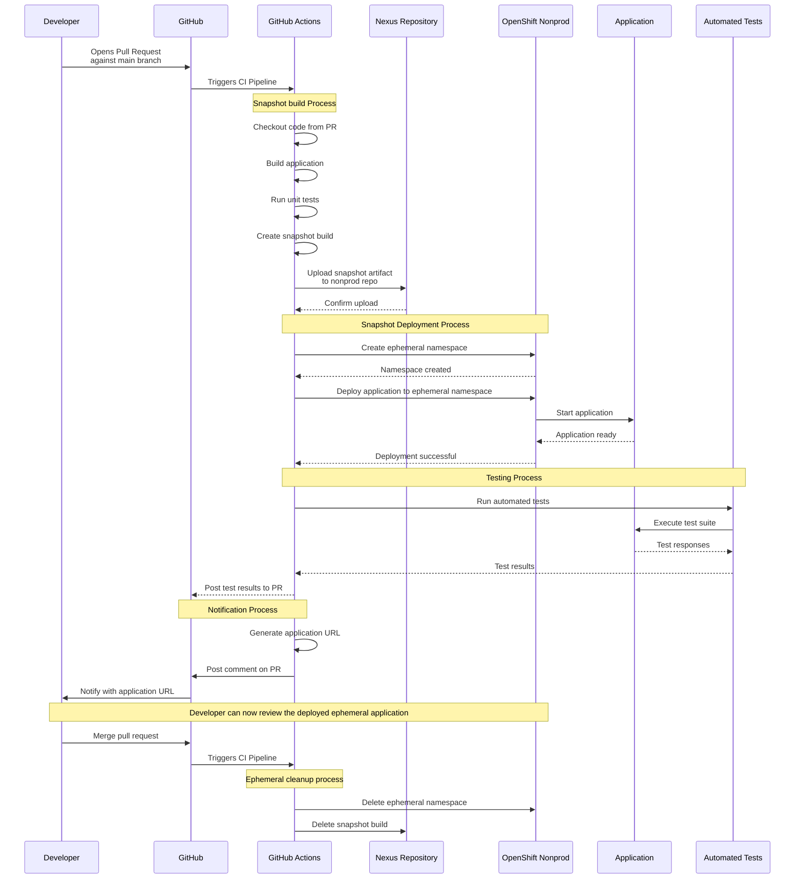
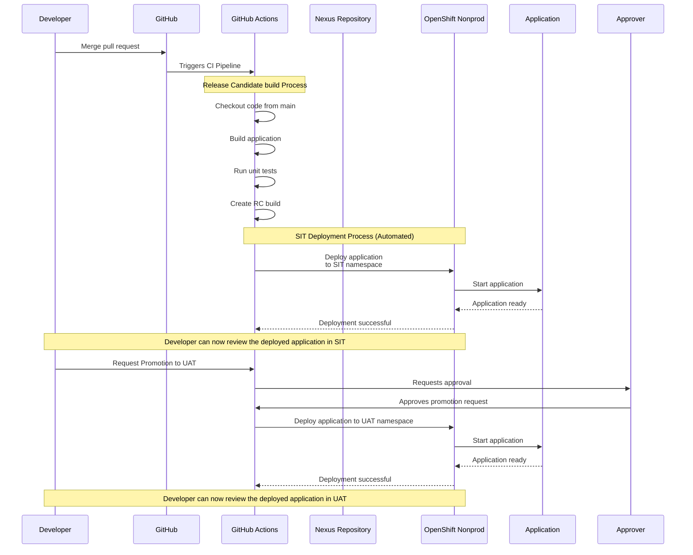
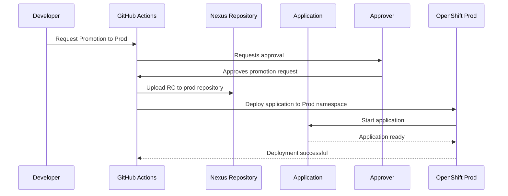

# PR and Ephemeral Build

```mermaid
sequenceDiagram
    participant Dev as Developer
    participant GH as GitHub
    participant GA as GitHub Actions
    participant Nexus as Nexus Repository
    participant OSD as OpenShift Nonprod
    participant App as Application
    participant Tests as Automated Tests

    Dev->>GH: Opens Pull Request <br/>against main branch
    GH->>GA: Triggers CI Pipeline
    
    Note over GA: Snapshot build Process
    GA->>GA: Checkout code from PR
    GA->>GA: Build application
    GA->>GA: Run unit tests
    GA->>GA: Create snapshot build
    
    GA->>Nexus: Upload snapshot artifact <br/>to nonprod repo
    Nexus-->>GA: Confirm upload
    
    Note over GA,OSD: Snapshot Deployment Process
    GA->>OSD: Create ephemeral namespace
    OSD-->>GA: Namespace created
    
    GA->>OSD: Deploy application to ephemeral namespace
    OSD->>App: Start application
    App-->>OSD: Application ready
    OSD-->>GA: Deployment successful
    
    Note over GA,Tests: Testing Process
    GA->>Tests: Run automated tests
    Tests->>App: Execute test suite
    App-->>Tests: Test responses
    Tests-->>GA: Test results
    GA-->>GH: Post test results to PR
    
    Note over GA,GH: Notification Process
    GA->>GA: Generate application URL
    GA->>GH: Post comment on PR
    GH->>Dev: Notify with application URL
    
    Note over Dev,OSD: Developer can now review the deployed ephemeral application
    Dev->>GH: Merge pull request
    GH->>GA: Triggers CI Pipeline
    
    Note over GA: Ephemeral cleanup process
    GA->>OSD: Delete ephemeral namespace
    GA->>Nexus: Delete snapshot build

```

# Promotion - Nonprod

```mermaid
sequenceDiagram
    participant Dev as Developer
    participant GH as GitHub
    participant GA as GitHub Actions
    participant Nexus as Nexus Repository
    participant OSD as OpenShift Nonprod
    participant App as Application
    participant TL as Approver

    Dev->>GH: Merge pull request
    GH->>GA: Triggers CI Pipeline

    Note over GA: Release Candidate build Process
    GA->>GA: Checkout code from main
    GA->>GA: Build application
    GA->>GA: Run unit tests
    GA->>GA: Create RC build
    
    Note over GA,OSD: SIT Deployment Process (Automated)
    GA->>OSD: Deploy application <br/>to SIT namespace
    OSD->>App: Start application
    App-->>OSD: Application ready
    OSD-->>GA: Deployment successful
    
    Note over Dev,OSD: Developer can now review the deployed application in SIT
    Dev->>GA: Request Promotion to UAT
    GA->>TL: Requests approval
    TL->>GA: Approves promotion request

    GA->>OSD: Deploy application to UAT namespace 
    OSD->>App: Start application
    App-->>OSD: Application ready
    OSD-->>GA: Deployment successful

    Note over Dev,OSD: Developer can now review the deployed application in UAT

```
# Promotion - Prod

```mermaid
sequenceDiagram
    participant Dev as Developer
    participant GA as GitHub Actions
    participant Nexus as Nexus Repository
    participant App as Application
    participant TL as Approver
    participant OSP as OpenShift Prod

    Dev->>GA: Request Promotion to Prod
    GA->>TL: Requests approval
    TL->>GA: Approves promotion request

    GA->>Nexus: Upload RC to prod repository

    GA->>OSP: Deploy application to Prod namespace
    OSP->>App: Start application
    App-->>OSP: Application ready
    OSP-->>GA: Deployment successful

```

