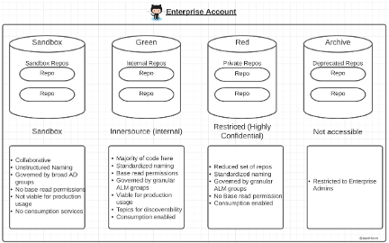

GitHub/IBM POV-1 (GI-POV-1)  
GitHub Organization Design

Prepared by: Christopher Kovacs  
Date: April 15, 2025  
Version: 1.0

# Executive Summary

GitHub Enterprise Cloud (GHEC) consists of an enterprise account that is subdivided into organizations and repositories. Repositories contain the code and / or configuration of enterprise applications and are accessed by users organized into teams. Generally, repositories will follow the software application architectural patterns established in the company adopting GHEC, and (potentially nested) teams and users will be derived from the company’s Identity Provider (IdP) and will follow the company’s development team organizational structure.

GHEC provides for a relatively flat structure when compared with other source code management (SCM) solutions and relies on other techniques to provide for visibility and granularity. This difference requires updating repository configuration strategies and approaches when migrating from other SCMs.

# Guiding Principles

1. **Simplicity and clarity.** Maintain simple and clear organizational structures to enhance usability and reduce administrative overhead.
2. **Empowered Collaboration.** Facilitate open and effective collaboration within and across teams through clear access controls and transparent processes.
3. **Scalability and Flexibility.** Structure the organization to easily scale and adapt to future growth and changes in team composition.
4. **Security and Compliance.** Embed security and compliance practices directly into the organizational structure and repository management.

# Recommended Best Practices

1. **Reduce the number of Organizations.** Minimize the number of organizations in use to lower administrative overhead. Leverage the “Red-green-sandbox-archive” model from the “How to Get Started” document linked in the references section (or [click here for a direct reference](https://assets.ctfassets.net/wfutmusr1t3h/ooXuGRtFrKHrFZ8cIdbUC/4333e8014b2e950d9381bdb102415e3a/GitHub-Enterprise-Cloud_ebook.pdf#page=16)) to help guide decisions. See the following figure for more information.

2. **Use EMUs.** Leverage Enterprise Managed Users derived from the company’s primary Identity Provider to increase security and to offload user lifecycle responsibility to systems of record.
3. **Leverage repository topics to allow for repository discovery.** Leverage topics to group repositories into sensible topics or applications. This can emulate the grouping found in other SCM systems.
4. **Use automation for the creation of repositories, topics, and properties**. Leverage GitHub IssueOps or internal developer portal (IDP), combined with GitOps automation techniques, to allow teams to request the creation or modification of a GitHub repository. Leverage standard GitOps workflows to implement policy restrictions and separation of duties.
5. **Use properties and rulesets to apply common policies**. Leverage automation to apply properties to repositories representing varying levels of scrutiny and security required on applications of differing criticality or requiring elevated compliance adherence. Apply rulesets based on these properties to provide for required policy constraints.

# Key Decisions and Recommendations

| Decision ID | Decision Description | Rationale / Justification |
| --- | --- | --- |

# References and Additional Reading

\- [Best practices for organizations and teams using GitHub Enterprise Cloud](https://github.blog/enterprise-software/devops/best-practices-for-organizations-and-teams-using-github-enterprise-cloud/)  
\- [How to get started with GitHub Enterprise Cloud](https://assets.ctfassets.net/wfutmusr1t3h/ooXuGRtFrKHrFZ8cIdbUC/4333e8014b2e950d9381bdb102415e3a/GitHub-Enterprise-Cloud_ebook.pdf)  
\- [Using GitHub IssueOps](https://issue-ops.github.io/docs/)