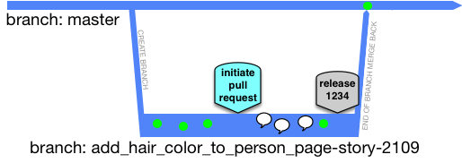

GitHub/IBM POV-2 (GI-POV-2)  
Branching Strategies

Prepared by: Christopher Kovacs  
Date: May 5, 2025  
Version: 1.0

# Executive Summary

Branching strategies are essential frameworks that guide how development teams collaborate on code changes within version control systems. They define how code flows from development to production and significantly impact a team's ability to deliver software efficiently, safely, and predictably. The choice of branching strategy affects release cadence, code quality, and the team's ability to respond to production issues.

This document examines three prominent branching strategies: [Trunk-Based Development](https://trunkbaseddevelopment.com/5-min-overview/), Branch-for-Release, and Git Flow—and discusses the release management practices necessary for their successful implementation. Each strategy offers distinct advantages and challenges, making them suitable for different team sizes, release cadences, and organizational contexts. Additionally, this document explores how feature flags, parallel change patterns, and versioning approaches can complement these branching strategies to enhance deployment safety and flexibility.

Selecting the appropriate branching strategy is a critical architectural decision that should align with an organization's development culture, release requirements, and operational capabilities. This document aims to provide guidance for making informed decisions about which branching strategy to adopt and how to implement it effectively.

# Guiding Principles

1. **Simplicity and clarity.** Adopt branching strategies that are easy to understand and follow, reducing cognitive overhead for developers and minimizing the risk of errors.
2. **Continuous integration.** Prioritize frequent integration of code changes to detect conflicts early and ensure that the codebase remains in a releasable state.
3. **Deployment safety.** Implement practices that minimize the risk of introducing defects into production while enabling rapid recovery when issues occur.
4. **Development velocity.** Choose approaches that enable teams to deliver value quickly without compromising quality or stability.
5. **Scalability.** Ensure that the selected branching strategy can accommodate growth in team size, codebase complexity, and deployment frequency.

# Recommended Best Practices

## 1. Trunk-Based Development

[Trunk-Based Development](https://trunkbaseddevelopment.com/5-min-overview/) is a branching strategy where developers collaborate on code in a single branch called 'trunk' (or 'main' in Git). This approach emphasizes continuous integration and short-lived feature branches that merge back to the trunk frequently.

### Workflow

- Developers create short-lived feature branches (typically lasting less than a day) or commit directly to the trunk for smaller changes.
- Continuous integration runs on all commits to verify that they don't break the build.
- The trunk is kept in a releasable state at all times.
- Releases can be made directly from the trunk or through dedicated release branches.

### Required Release Management Practices

1. **Robust automated testing.** Comprehensive test suites must run on every commit to ensure the trunk remains stable.
2. **Feature flags.** Use feature flags (like those provided by LaunchDarkly) to hide incomplete features in production until they're ready, allowing code to be merged to trunk before features are complete.
3. **Continuous deployment pipeline.** Implement a reliable CI/CD pipeline that can quickly deploy changes to production.
4. **Monitoring and observability.** Robust monitoring systems must be in place to quickly detect and address issues in production.
5. **Branch by abstraction.** For larger changes, use the branch by abstraction technique to make significant architectural changes without long-lived branches.

### Benefits

- **Reduced merge conflicts.** Frequent integration minimizes complex merge conflicts.
- **Faster feedback cycles.** Developers get immediate feedback on their changes.
- **Improved collaboration.** The entire team works on the same codebase, enhancing knowledge sharing.
- **Simplified release process.** The trunk is always in a releasable state, making releases more predictable.
- **Better alignment with CI/CD.** This approach naturally supports continuous integration and delivery practices.

### Drawbacks

- **Requires disciplined development practices.** Developers must ensure their changes don't break the trunk.
- **May be challenging for less experienced teams.** The approach requires strong testing and collaboration skills.
- **Feature flags add complexity.** Managing feature flags introduces additional complexity to the codebase.
- **Potential for incomplete features in production.** Even with feature flags, incomplete code exists in the production codebase.

### Alternative - GitHub Flow

[GitHub Flow](https://trunkbaseddevelopment.com/alternative-branching-models/#github-flow) is a simplified alternative to Trunk-Based Development that maintains the focus on the main branch while introducing a more structured pull request workflow. Like Trunk-Based Development, GitHub Flow centers around a single main branch that is always deployable, but differs in its approach to feature development. While Trunk-Based Development emphasizes extremely short-lived branches or direct commits to trunk, GitHub Flow allows for longer-lived feature branches with a formal pull request process for code review before merging. Both strategies prioritize continuous integration and deployment, but GitHub Flow provides more opportunity for collaboration and review before changes reach the main branch, making it particularly well-suited for open source projects and teams that require more structured code review processes.

In standard GitHub flow, code is merged from a feature branch to trunk (main) after a build has been completed and a release is generated. Releasing _after_ a merge to trunk has been completed aligns this approach to trunk-based development. 

    

## 2. Branch-for-Release

[Branch-for-Release](https://trunkbaseddevelopment.com/branch-for-release/) is a strategy where development occurs on the main branch, and release branches are created just before a release. These branches are used for final stabilization and bug fixes specific to the release.

    

### Workflow

- Development happens on the main branch.
- When preparing for a release, a release branch is created from the main branch.
- Only bug fixes are applied to the release branch; new features continue to be developed on the main branch.
- Critical fixes may be backported from the release branch to the main branch.
- Once the release is deployed and stable, the release branch may be archived.

### Required Release Management Practices

1. **Clear release schedule.** Teams need a well-defined release cadence to plan when to create release branches.
2. **Version management.** Each release branch should be associated with a specific version number.
3. **Backporting process.** A process must exist for applying critical fixes from release branches back to the main branch.
4. **Release branch lifecycle policy.** Define how long release branches are maintained and when they are archived.
5. **Hotfix procedure.** Establish a clear process for making emergency fixes to production releases.

### Benefits

- **Stable release candidates.** Release branches provide a stable codebase for final testing and deployment.
- **Support for multiple releases.** Multiple versions can be maintained simultaneously.
- **Reduced pressure on release timing.** Development can continue on the main branch while a release is being prepared.
- **Clear separation of concerns.** Development activities are separated from release stabilization.

### Drawbacks

- **Potential for divergence.** The main branch and release branches can drift apart if changes aren't properly backported.
- **Increased complexity.** Managing multiple active branches adds overhead.
- **Delayed integration of fixes.** Fixes made in release branches must be manually backported to the main branch.
- **Possible confusion about where to apply changes.** Developers may be uncertain whether to apply changes to the main branch or a release branch.

## 3. Git Flow

Git Flow is a robust branching model that defines specific branch types and their purposes. It provides a structured framework for managing releases, features, and hotfixes through a set of well-defined branches.

### Workflow

- The **main/master** branch contains production-ready code and represents the official release history.
- A parallel **develop** branch serves as the integration branch for ongoing development.
- **Feature branches** branch off from develop and merge back into develop when complete.
- **Release branches** branch off from develop when it's ready for a release, allowing for final polishing and bug fixes.
- **Hotfix branches** branch off from main/master to quickly address critical production issues.
- Release and hotfix branches merge into both main/master and develop to ensure changes are not lost.

### Required Release Management Practices

1. **Branch naming conventions.** Consistent naming for different branch types (e.g., feature/*, release/*, hotfix/*) is essential.
2. **Version tagging.** Each merge to main/master should be tagged with a version number.
3. **Release preparation process.** A defined process for creating and stabilizing release branches.
4. **Merge policies.** Clear rules for when and how branches can be merged.
5. **Environment management.** Different environments for development, testing, and production that align with the branching structure.

### Benefits

- **Structured release process.** The model provides a clear path for preparing and deploying releases.
- **Parallel development.** Multiple features can be developed simultaneously without interference.
- **Support for multiple production versions.** The model accommodates maintaining multiple release versions.
- **Clear separation of concerns.** Different branch types serve different purposes, making the workflow predictable.
- **Well-suited for scheduled releases.** The model works well for products with planned release cycles.

### Drawbacks

- **Complexity.** The model involves multiple branch types and merge patterns, increasing cognitive load.
- **Potential for long-lived branches.** Feature branches may become long-lived, leading to integration challenges.
- **Overhead for small teams.** The structured approach may be excessive for small teams or simple projects.
- **Less aligned with continuous delivery.** The model was designed for scheduled releases rather than continuous delivery.
- **Merge conflicts.** The frequency of merges between branches can lead to complex merge conflicts.

# Key Decisions and Recommendations

| Decision ID | Decision Description | Rationale / Justification |
| --- | --- | --- |
| 1 | Prefer [Trunk-Based Development](https://trunkbaseddevelopment.com/) (or GitHub Flow) for teams practicing continuous delivery | Trunk-Based Development aligns naturally with continuous delivery practices, enabling frequent, small releases and reducing integration issues.|
| 2 | Implement [Branch-for-Release](https://trunkbaseddevelopment.com/branch-for-release/) for products with defined release cycles | Branch-for-Release provides stability for planned releases while allowing development to continue, making it suitable for products with scheduled releases. |
| 3 | Consider [Git Flow](https://trunkbaseddevelopment.com/alternative-branching-models/#gitflow-and-similar) for complex products with scheduled releases | Git Flow provides a structured framework for managing complex products with multiple versions and scheduled releases, though it comes with significant additional overhead and significant risk of merge conflicts. |
| 4 | Integrate [feature flags](./gi-pov-2-assets/feature-flag.md) regardless of branching strategy | Feature flags decouple deployment from release, enhancing safety and flexibility for all branching strategies. |
| 5 | Use the [Parallel Change pattern](./gi-pov-2-assets/parallel-change.md) for breaking changes | This pattern enables safe implementation of breaking changes without long-lived branches, supporting continuous delivery. |
| 6 | Adopt [SemVer or RomVer](./gi-pov-2-assets/versioning-and-convential-commits.md) for APIs and libraries | SemVer/RomVer communicates the nature of changes clearly to consumers, making it ideal for APIs and libraries. |
| 7 | Consider [CalVer](./gi-pov-2-assets/versioning-and-convential-commits.md) for rapidly evolving products | CalVer works well for products with frequent releases where the timing of releases is more relevant than the nature of changes. |
| 8 | Implement [Conventional Commits](./gi-pov-2-assets/versioning-and-convential-commits.md) for automated versioning | Conventional Commits reduces manual effort in version management and changelog generation, improving consistency and efficiency. |

# References and Additional Reading

- [Trunk-Based Development](https://trunkbaseddevelopment.com/)  
- [Git Flow Original Article](https://nvie.com/posts/a-successful-git-branching-model/)  
- [Branch by Abstraction](https://martinfowler.com/bliki/BranchByAbstraction.html) 
- [Feature Flags](./gi-pov-2-assets/feature-flag.md) 
- [Parallel Change Pattern](./gi-pov-2-assets/parallel-change.md) 
- [Versioning and Conventional Commits](./gi-pov-2-assets/versioning-and-convential-commits.md) 